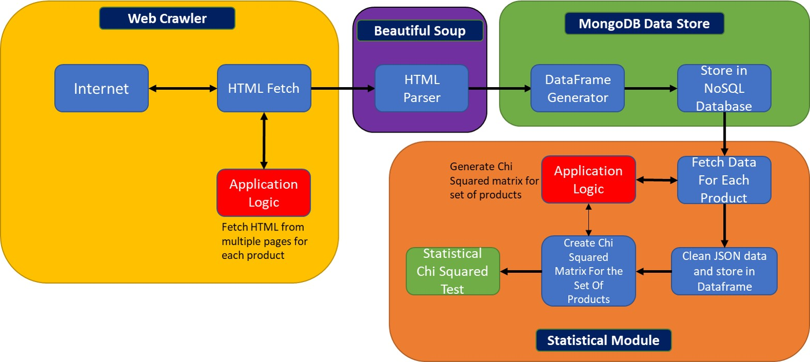

# Statistical Analysis of 5 Star product review ratings distribution to test whether the distributions are similar or not
Sentiment Analysis of Online reviews to test whether Online product reviews are trustworthy

Problem Statement: Our objective is to certify whether the ratings published by EBAY for its products grouped by similar product categories under best sellers with the same published rating are reliable or does the user need to be suspicious about the published ratings for the group of top 2 or more products with similar ratings in a given product category. 

Project Scope: EBAY Inc. on its website states that customer reviews for a product don’t use a simple average of the star ratings of all the reviews but instead, its rating system considers things like how recent a review is and analyzes the text of the reviews to verify the trustworthiness of the reviews. However, this doesn’t imply that two products in the same product category with the same average rating would be exactly the same in terms of quality or the consistency of the reviews. One approach is to analyze if the distribution of star ratings across the top bestseller products with the same average rating score published by EBAY are similar. To do this study, reviews corresponding to the most recent reviews ordered by date published are selected for each product. The published review score is mapped to the star rating and the number of reviews belonging to each of the ratings (1 star, 2 star, 3 star, 4 star, 5 star) is tabulated for each of the products. The results of this analysis will provide a decision framework for the buyer to decide whether they could trust the review by EBAY to determine if products in same category with the same average rating are infact similar or whether the buyer should do more research by looking into specific review descriptions.  

Null Hypothesis: The distribution of star ratings is the same across all the brands (2 or more) in the same product category with same published average EBAY rating.

Hypothesis Test: The Chi square test methodology shown in example 14.4, pg 731 of the textbook “Mathematical Statistics With Applications” is used to evaluate whether the null hypothesis is acceptable with 95% confidence. In this test, the critical value with alpha of 0.05 and (r-1)*(c-1) or (5-1)*(3-1) = 8 degrees of freedom for the Chi square statistic is calculated. The Chi square statistic is used in lieu of other statistical tests such as the t-test or the z-test given the fact that we are dealing with proportions and categorical data. 

Tools Used: Python. Scipy, pandas, matplotlib, numpy, seaborn, beautifulsoup, mongoDB.

Solution Architecture:

